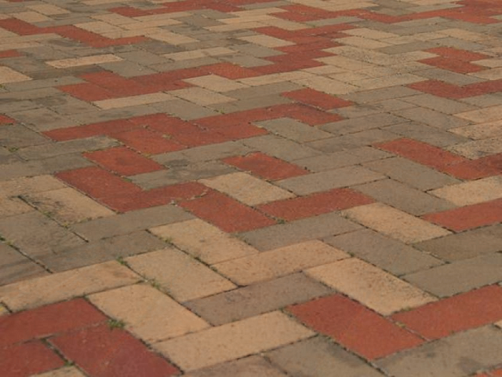
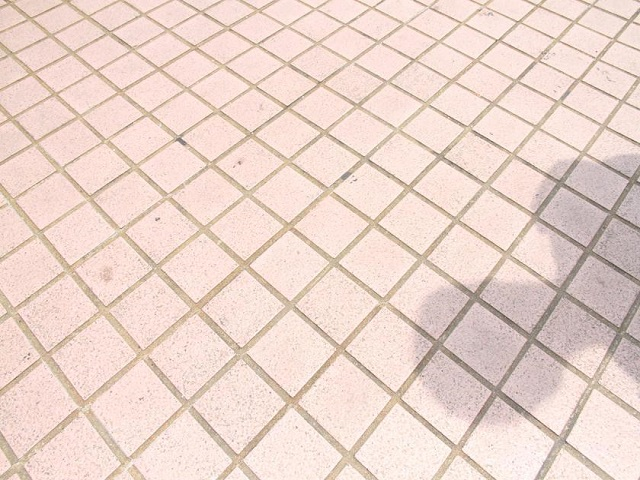
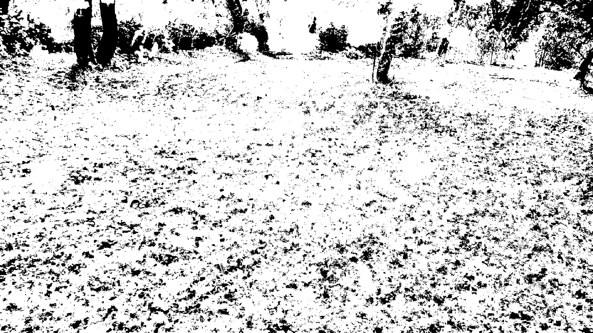

# Code for LAB-Net
## Paper name
LAB-Net: LAB Color-Space oriented Lightweight Network for Shadow Removal
## Our result

### ISTD and SRD results

#### ISTD results
<table class="tg">
<thead>
  <tr>
    <th class="tg-c3ow" colspan="3">S</th>
    <th class="tg-c3ow" colspan="3">NS</th>
    <th class="tg-c3ow" colspan="3">ALL</th>
  </tr>
</thead>
<tbody>
  <tr>
    <td class="tg-c3ow">RMSE</td>
    <td class="tg-c3ow">PSNR</td>
    <td class="tg-c3ow">SSIM</td>
    <td class="tg-c3ow">RMSE</td>
    <td class="tg-c3ow">PSNR</td>
    <td class="tg-c3ow">SSIM</td>
    <td class="tg-c3ow">RMSE</td>
    <td class="tg-c3ow">PSNR</td>
    <td class="tg-c3ow">SSIM</td>
  </tr>
  <tr>
    <td class="tg-c3ow">6.65</td>
    <td class="tg-c3ow">37.17</td>
    <td class="tg-c3ow">0.9887</td>
    <td class="tg-c3ow">4.49</td>
    <td class="tg-c3ow">32.42</td>
    <td class="tg-c3ow">0.9727</td>
    <td class="tg-c3ow">4.84</td>
    <td class="tg-c3ow">30.49</td>
    <td class="tg-c3ow">0.9563</td>
  </tr>
</tbody>
</table>

All the ISTD results can be found [here](https://drive.google.com/drive/folders/12IO_H3uOynFXshx4K4gOWea2tATXKct3?usp=sharing)

#### SRD results
<table class="tg">
<thead>
  <tr>
    <th class="tg-c3ow" colspan="3">S</th>
    <th class="tg-c3ow" colspan="3">NS</th>
    <th class="tg-c3ow" colspan="3">ALL</th>
  </tr>
</thead>
<tbody>
  <tr>
    <td class="tg-c3ow">RMSE</td>
    <td class="tg-c3ow">PSNR</td>
    <td class="tg-c3ow">SSIM</td>
    <td class="tg-c3ow">RMSE</td>
    <td class="tg-c3ow">PSNR</td>
    <td class="tg-c3ow">SSIM</td>
    <td class="tg-c3ow">RMSE</td>
    <td class="tg-c3ow">PSNR</td>
    <td class="tg-c3ow">SSIM</td>
  </tr>
  <tr>
    <td class="tg-c3ow">6.56</td>
    <td class="tg-c3ow">35.71</td>
    <td class="tg-c3ow">0.9818</td>
    <td class="tg-c3ow">3.77</td>
    <td class="tg-c3ow">36.5</td>
    <td class="tg-c3ow">0.9813</td>
    <td class="tg-c3ow">4.6</td>
    <td class="tg-c3ow">32.22</td>
    <td class="tg-c3ow">0.9554</td>
  </tr>
</tbody>
</table>

All the SRD results can be found [here](https://drive.google.com/drive/folders/1G3oWIYnk2EYxl3t1-aLVGoKExGXM0car?usp=sharing)

#### more texture results

shadow images:
<table rules="none" align="center">
	<tr>
		<td>
			<center>
				
				<br/>
				<font color="AAAAAA">105-1</font>
			</center>
		</td>
		<td>
			<center>
				
				<br/>
				<font color="AAAAAA">125-1</font>
			</center>
		</td>
		<td>
			<center>
				
				<br/>
				<font color="AAAAAA">IMG_6581</font>
			</center>
		</td>
		<td>
			<center>
				
				<br/>
				<font color="AAAAAA">IMG_6916</font>
			</center>
		</td>
	</tr>
</table>

results:
<table rules="none" align="center">
	<tr>
		<td>
			<center>
				
				<br/>
				<font color="AAAAAA">105-1</font>
			</center>
		</td>
		<td>
			<center>
				
				<br/>
				<font color="AAAAAA">125-1</font>
			</center>
		</td>
		<td>
			<center>
				
				<br/>
				<font color="AAAAAA">IMG_6581</font>
			</center>
		</td>
		<td>
			<center>
				
				<br/>
				<font color="AAAAAA">IMG_6916</font>
			</center>
		</td>
	</tr>
</table>


#### light/dark versions of the same color

shadow images:
<table rules="none" align="center">
	<tr>
		<td>
			<center>
				
				<br/>
				<font color="AAAAAA">97-2</font>
			</center>
		</td>
		<td>
			<center>
				
				<br/>
				<font color="AAAAAA">116-4</font>
			</center>
		</td>
		<td>
			<center>
				
				<br/>
				<font color="AAAAAA">IMG_6425</font>
			</center>
		</td>
		<td>
			<center>
				
				<br/>
				<font color="AAAAAA">IMG_6793</font>
			</center>
		</td>
	</tr>
</table>

results:
<table rules="none" align="center">
	<tr>
		<td>
			<center>
				
				<br/>
				<font color="AAAAAA">97-2</font>
			</center>
		</td>
		<td>
			<center>
				
				<br/>
				<font color="AAAAAA">116-4</font>
			</center>
		</td>
		<td>
			<center>
				
				<br/>
				<font color="AAAAAA">IMG_6425</font>
			</center>
		</td>
		<td>
			<center>
				
				<br/>
				<font color="AAAAAA">IMG_6793</font>
			</center>
		</td>
	</tr>
</table>

#### small/tiny shadows

shadow images:
<table rules="none" align="center">
	<tr>
		<td>
			<center>
				
				<br/>
				<font color="AAAAAA">117-15</font>
			</center>
		</td>
		<td>
			<center>
				
				<br/>
				<font color="AAAAAA">124-13</font>
			</center>
		</td>
		<td>
			<center>
				
				<br/>
				<font color="AAAAAA">_MG_3121</font>
			</center>
		</td>
		<td>
			<center>
				
				<br/>
				<font color="AAAAAA">_MG_5956</font>
			</center>
		</td>
	</tr>
</table>

results:
<table rules="none" align="center">
	<tr>
		<td>
			<center>
				
				<br/>
				<font color="AAAAAA">117-15</font>
			</center>
		</td>
		<td>
			<center>
				
				<br/>
				<font color="AAAAAA">124-13</font>
			</center>
		</td>
		<td>
			<center>
				
				<br/>
				<font color="AAAAAA">_MG_3121</font>
			</center>
		</td>
		<td>
			<center>
				
				<br/>
				<font color="AAAAAA">_MG_5956</font>
			</center>
		</td>
	</tr>
</table>

#### shallow shadows

shadow images:
<table rules="none" align="center">
	<tr>
		<td>
			<center>
				
				<br/>
				<font color="AAAAAA">94-1</font>
			</center>
		</td>
		<td>
			<center>
				
				<br/>
				<font color="AAAAAA">97-5</font>
			</center>
		</td>
		<td>
			<center>
				
				<br/>
				<font color="AAAAAA">IMG_5467</font>
			</center>
		</td>
		<td>
			<center>
				
				<br/>
				<font color="AAAAAA">IMG_5491</font>
			</center>
		</td>
	</tr>
</table>

results:
<table rules="none" align="center">
	<tr>
		<td>
			<center>
				
				<br/>
				<font color="AAAAAA">94-1</font>
			</center>
		</td>
		<td>
			<center>
				
				<br/>
				<font color="AAAAAA">97-5</font>
			</center>
		</td>
		<td>
			<center>
				
				<br/>
				<font color="AAAAAA">IMG_5467</font>
			</center>
		</td>
		<td>
			<center>
				
				<br/>
				<font color="AAAAAA">IMG_5491</font>
			</center>
		</td>
	</tr>
</table>

#### penumbra/soft shadows

shadow images:
<table rules="none" align="center">
	<tr>
		<td>
			<center>
				
				<br/>
				<font color="AAAAAA">99-3</font>
			</center>
		</td>
		<td>
			<center>
				
				<br/>
				<font color="AAAAAA">124-4</font>
			</center>
		</td>
		<td>
			<center>
				
				<br/>
				<font color="AAAAAA">_MG_5771</font>
			</center>
		</td>
		<td>
			<center>
				
				<br/>
				<font color="AAAAAA">IMG_6456</font>
			</center>
		</td>
	</tr>
</table>

results:
<table rules="none" align="center">
	<tr>
		<td>
			<center>
				
				<br/>
				<font color="AAAAAA">99-3</font>
			</center>
		</td>
		<td>
			<center>
				
				<br/>
				<font color="AAAAAA">124-4</font>
			</center>
		</td>
		<td>
			<center>
				
				<br/>
				<font color="AAAAAA">_MG_5771</font>
			</center>
		</td>
		<td>
			<center>
				
				<br/>
				<font color="AAAAAA">IMG_6456</font>
			</center>
		</td>
	</tr>
</table>

#### shadows on black objects

shadow images:
<table rules="none" align="center">
	<tr>
		<td>
			<center>
				
				<br/>
				<font color="AAAAAA">125-1</font>
			</center>
		</td>
		<td>
			<center>
				
				<br/>
				<font color="AAAAAA">111-2</font>
			</center>
		</td>
		<td>
			<center>
				
				<br/>
				<font color="AAAAAA">_MG_5728</font>
			</center>
		</td>
		<td>
			<center>
				
				<br/>
				<font color="AAAAAA">IMG_6760</font>
			</center>
		</td>
	</tr>
</table>

results:
<table rules="none" align="center">
	<tr>
		<td>
			<center>
				
				<br/>
				<font color="AAAAAA">125-1</font>
			</center>
		</td>
		<td>
			<center>
				
				<br/>
				<font color="AAAAAA">111-2</font>
			</center>
		</td>
		<td>
			<center>
				
				<br/>
				<font color="AAAAAA">_MG_5728</font>
			</center>
		</td>
		<td>
			<center>
				
				<br/>
				<font color="AAAAAA">IMG_6760</font>
			</center>
		</td>
	</tr>
</table>

### Generalization
We test the SBU-TimeLapse Dataset (video), USR and ADE using the model trained on ISTD.

The mask of these data is obtained by shadow detector [1].

[1] Mitigating Intensity Bias in Shadow Detection via Feature Decomposition and Reweighting

#### SBU-TimeLapse Dataset (video)
<table rules="none" align="center">
	<tr>
		<td>
			<center>
				
				<br/>
				<font color="AAAAAA">shadow image</font>
			</center>
		</td>
		<td>
			<center>
				
				<br/>
				<font color="AAAAAA">res</font>
			</center>
		</td>
		<td>
			<center>
				
				<br/>
				<font color="AAAAAA">mask</font>
			</center>
		</td>
	</tr>
</table>

<table rules="none" align="center">
	<tr>
		<td>
			<center>
				
				<br/>
				<font color="AAAAAA">shadow image</font>
			</center>
		</td>
		<td>
			<center>
				
				<br/>
				<font color="AAAAAA">res</font>
			</center>
		</td>
		<td>
			<center>
				
				<br/>
				<font color="AAAAAA">mask</font>
			</center>
		</td>
	</tr>
</table>

<table rules="none" align="center">
	<tr>
		<td>
			<center>
				
				<br/>
				<font color="AAAAAA">shadow image</font>
			</center>
		</td>
		<td>
			<center>
				
				<br/>
				<font color="AAAAAA">res</font>
			</center>
		</td>
		<td>
			<center>
				
				<br/>
				<font color="AAAAAA">mask</font>
			</center>
		</td>
	</tr>
</table>

<table rules="none" align="center">
	<tr>
		<td>
			<center>
				
				<br/>
				<font color="AAAAAA">shadow image</font>
			</center>
		</td>
		<td>
			<center>
				
				<br/>
				<font color="AAAAAA">res</font>
			</center>
		</td>
		<td>
			<center>
				
				<br/>
				<font color="AAAAAA">mask</font>
			</center>
		</td>
	</tr>
</table>

#### USR

<table rules="none" align="center">
	<tr>
		<td>
			<center>
				
				<br/>
				<font color="AAAAAA">shadow image</font>
			</center>
		</td>
		<td>
			<center>
				
				<br/>
				<font color="AAAAAA">res</font>
			</center>
		</td>
		<td>
			<center>
				
				<br/>
				<font color="AAAAAA">mask</font>
			</center>
		</td>
	</tr>
</table>

<table rules="none" align="center">
	<tr>
		<td>
			<center>
				
				<br/>
				<font color="AAAAAA">shadow image</font>
			</center>
		</td>
		<td>
			<center>
				
				<br/>
				<font color="AAAAAA">res</font>
			</center>
		</td>
		<td>
			<center>
				
				<br/>
				<font color="AAAAAA">mask</font>
			</center>
		</td>
	</tr>
</table>

<table rules="none" align="center">
	<tr>
		<td>
			<center>
				
				<br/>
				<font color="AAAAAA">shadow image</font>
			</center>
		</td>
		<td>
			<center>
				
				<br/>
				<font color="AAAAAA">res</font>
			</center>
		</td>
		<td>
			<center>
				
				<br/>
				<font color="AAAAAA">mask</font>
			</center>
		</td>
	</tr>
</table>

<table rules="none" align="center">
	<tr>
		<td>
			<center>
				
				<br/>
				<font color="AAAAAA">shadow image</font>
			</center>
		</td>
		<td>
			<center>
				
				<br/>
				<font color="AAAAAA">res</font>
			</center>
		</td>
		<td>
			<center>
				
				<br/>
				<font color="AAAAAA">mask</font>
			</center>
		</td>
	</tr>
</table>

#### ADE

<table rules="none" align="center">
	<tr>
		<td>
			<center>
				
				<br/>
				<font color="AAAAAA">shadow image</font>
			</center>
		</td>
		<td>
			<center>
				
				<br/>
				<font color="AAAAAA">res</font>
			</center>
		</td>
		<td>
			<center>
				
				<br/>
				<font color="AAAAAA">mask</font>
			</center>
		</td>
	</tr>
</table>

### Examples of different modeling methods for L channel and AB channel

shadow images:
<table rules="none" align="center">
	<tr>
		<td>
			<center>
				
				<br/>
				<font color="AAAAAA">10-17</font>
			</center>
		</td>
		<td>
			<center>
				
				<br/>
				<font color="AAAAAA">32-8</font>
			</center>
		</td>
		<td>
			<center>
				
				<br/>
				<font color="AAAAAA">_MG_2763</font>
			</center>
		</td>
		<td>
			<center>
				
				<br/>
				<font color="AAAAAA">IMG_6507</font>
			</center>
		</td>
	</tr>
</table>

Replacing L channel of input with that of gt without changing the AB channels:
<table rules="none" align="center">
	<tr>
		<td>
			<center>
				
				<br/>
				<font color="AAAAAA">10-17</font>
			</center>
		</td>
		<td>
			<center>
				
				<br/>
				<font color="AAAAAA">32-8</font>
			</center>
		</td>
		<td>
			<center>
				
				<br/>
				<font color="AAAAAA">_MG_2763</font>
			</center>
		</td>
		<td>
			<center>
				
				<br/>
				<font color="AAAAAA">IMG_6507</font>
			</center>
		</td>
	</tr>
</table>
In these examples, L=G(L), AB=AB.

## Requirements
python=3.7.13

pytorch=1.12.1
```bash
pip install -r requirments.txt
```
## Train
### Train ISTD
#### 1. Modify './script/train.sh'
1. Adjust loadSize(256), FineSize(256), down_w(256), down_h(256)
2.  Add dataroot(ISTD trainset path), name(task name)
#### 2. Run 'train.sh'
```bash
cd script
bash train.sh 0
```
0 is the gpu number
### Train SRD
#### 1. Modify './script/train.sh'
1. Adjust batchs(1)
2. Adjust loadSize(400), FineSize(400), down_w(128), down_h(128)
3.  Add dataroot(SRD trainset path), name(task name)
#### 2. Run 'train.sh'
```bash
cd script
bash train.sh 0
```
0 is the gpu number
### See loss
You can see the train loss:
```bash
cd script
tensorboard --logdir LAB_G_LABNet_name
```
## Test
1. You can download our pretrained model to test.

Our ISTD checkpoint can be found [here](https://drive.google.com/drive/folders/1GWLLBi-ZBREnqWPSCgCv8Ha-8iiLILXS?usp=sharing)

Our SRD checkpoint can be found [here](https://drive.google.com/drive/folders/15jwF-Sq3xFWJL_tGorhRsnSr5ya9GITX?usp=sharing)

Please move the .pth to a directory to use.
### Test ISTD
#### 1. Modify './script/test.sh'
1. Adjust size_w(640), size_h(480), down_w(256), down_h(256)
2. Add dataroot(ISTD testset path), name(task name), resroot(path to save the result)
#### 2. Run 'test.sh'
```bash
cd script
bash test.sh 0
```
0 is the gpu number
### Test SRD
#### 1. Modify './script/test.sh'
1. Adjust size_w(840), size_h(640), down_w(128), down_h(128)
2. Add dataroot(SRD testset path), name(task name), resroot(path to save the result)
#### 2. Run 'test.sh'
```bash
cd script
bash test.sh 0
```
0 is the gpu number
